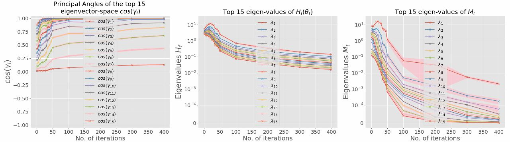
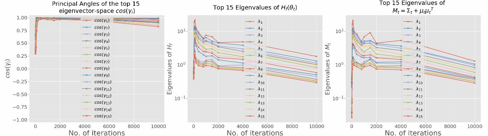
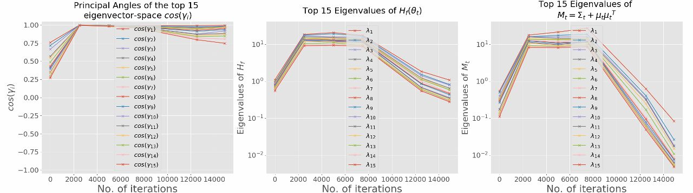

## SGD Dynamics

This project focused on study the relationship between the Hessian of the loss and the second moment of stochastic gradients (SGs).

### Hessian Decomposition

,

Figure 1: Eigen-spectrum dynamics of the Hessian Hf, the second moment of SGs, and the residule term Hp. The network is trained on Gauss-10 dataset with small batches containing one twentieth of the training samples (5/100). Hp remains significant even after SGD converges, and is close to -Hf.

### Top Subspaces: Hessian and Second Moment
We assess the overlap between the principal eigen-spaces of Hf and Mt determined by the eigenvectors corresponding to the top (positive) eigenvalues of these matrices during training based on principal angles:

 (a) [Gauss-10, 0% random labels, 2-layer Relu network, batch size: 5/100] 

 (b) [MNIST, 0% random labels, 3-layer Relu network, batch size: 64/50,000] 

 (c) [CIFAR-10, 0% random labels, 3-layer Relu network, batch size: 256/60,000] 

Figure 2: Dynamics of top 15 principal angles between Hf and Mt and corresponding eigenvalues of Hf (middle) and Mt (right). For both synthetic and real datasets, the top 10 principal subspaces are well aligned.
