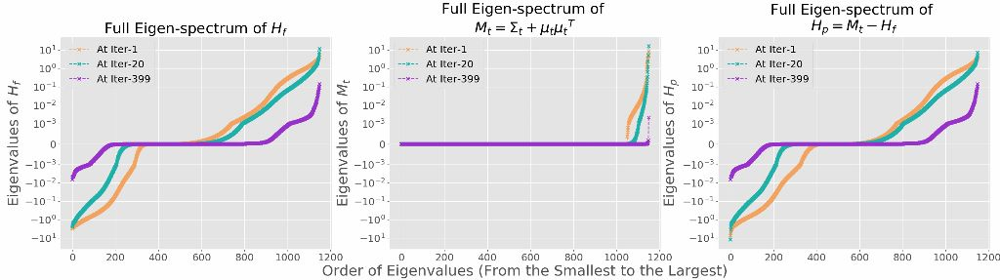

## SGD Dynamics

This project focused on study the relationship between the Hessian of the loss and the second moment of stochastic gradients (SGs).

### Hessian Decomposition

,

Figure 1: Eigen-spectrum dynamics of the Hessian Hf, the second moment of SGs, and the residule term Hp. The network is trained on Gauss-10 dataset with small batches containing one twentieth of the training samples (5/100). Hp remains significant even after SGD converges, and is close to -Hf.
